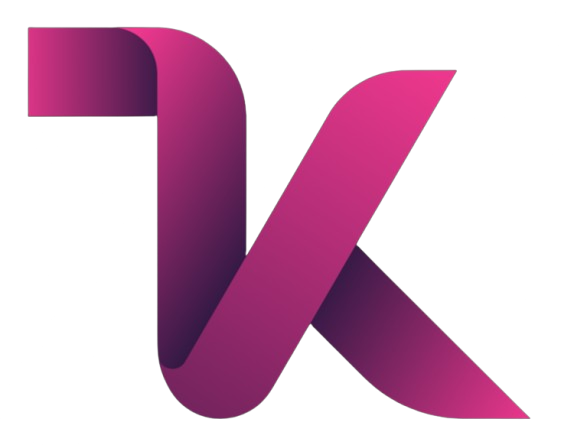

<p align="center">
  
</p>

# Monyenyo Official Website


**The official website for Monyenyo: Modern Indonesian brownies, menu, outlets, blog, and contact.**

---

## 📋 Project Overview

This project is a multi-page, fully responsive company profile and landing page for the Monyenyo brand. Built with pure HTML, CSS, and JavaScript (no backend framework), it showcases products, outlets, blog articles, and contact information in a modern, mobile-first design.

---

## ✨ Features & Highlights

- **Modern & Responsive Design**  
  Professional, mobile-first layout optimized for all devices (mobile, tablet, desktop).
- **Multi-Page Website**  
  Pages: Home, About, Menu, Blogs, Outlets, Contact.
- **Hamburger Menu & Overlay**  
  Mobile navigation with solid overlay, scroll lock, and consistent animation across all pages.
- **Auto-Hide Navbar on Mobile**  
  Navbar automatically hides on scroll down and only appears at the top (mobile only).
- **Attractive Hero Sections**  
  Each page features a strong headline and visual hero section.
- **Blog & Articles**  
  Simple blog system with category filters and modern article layouts.
- **WhatsApp & Maps Integration**  
  Floating WhatsApp button and outlet map (Leaflet.js).
- **Modern Contact Form**  
  AJAX contact form with validation and success notification.
- **SEO & Accessibility Optimized**  
  Semantic HTML, meta tags, and proper heading structure.
- **No Backend Framework**  
  Pure HTML, CSS, and JS. Easily deployable on any static hosting.

---

## 📁 Project Structure

```
index.html
about.html
menu.html
blogs.html
outlets.html
contact.html
css/
  main.css
  header.css
  footer.css
  about.css
  menu.css
  blogs.css
  outlets.css
  contact.css
js/
  slider.js
  translation.js
images/
docs/
```

---

## 🚀 Getting Started

1. **Clone the repository**
   ```bash
   git clone [repository-url]
   cd MONYENYO
   ```
2. **Open `index.html` in your browser**  
   No local server required, just open the file directly.

---

## 👤 Contributors

- [Your Name] (replace with your name)

## 📄 License

This project is licensed under the MIT License.

---

**Built with ❤️ for Monyenyo | Last Updated: June 2025**
